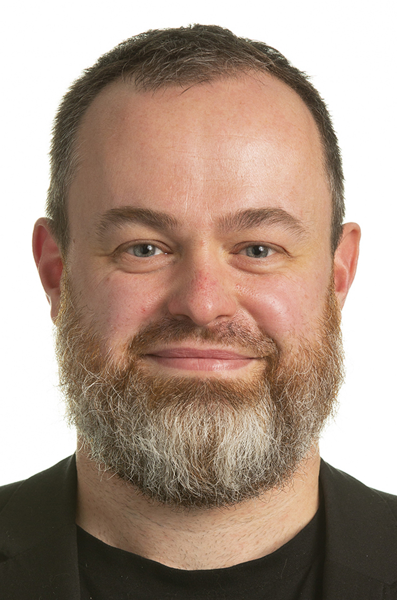
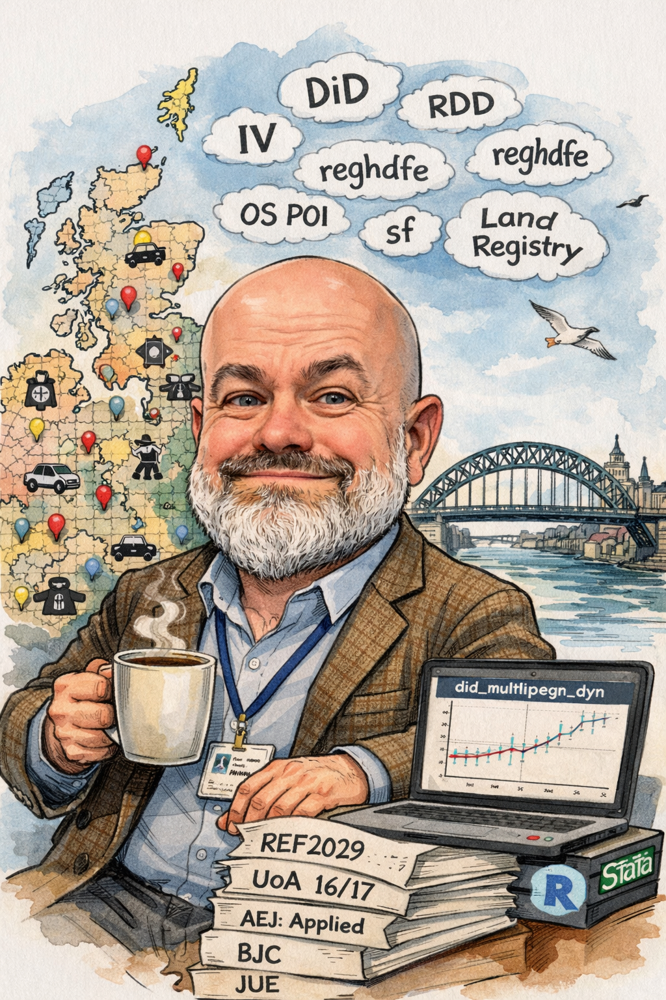

::: {.home-layout}
::: {.home-copy}
Professor of Economics at Newcastle University, working in empirical microeconomics and applied microeconometrics. My research uses large-scale administrative, survey, and geocoded data to study labour markets, the economics of crime, urban change, health, and related questions in international economics.

I joined Newcastle University in 2010 and currently serve as Head of Economics, jointly with Prof Jytte Seested-Nielsen. Before moving to Newcastle, I was a researcher and postdoctoral scholar at Leuphana University Lueneburg, where I also completed my doctorate in Economics.

## Research Themes

My research examines how people and places respond to shocks, incentives, and institutional change. Using applied microeconomic methods and often highly disaggregated spatial data, I study labour markets, crime, policing, and urban change.

### Labour Market Adjustment

I examine how workers and local labour markets respond to disruption, including mass layoffs, workplace unionisation, and the labour-market consequences of COVID-19. This work is motivated by a broader interest in how economic shocks alter employment, risk, and inequality over time.

### Crime, Policing, and Neighbourhoods

Much of my recent work focuses on crime, policing, and local disorder. I study the spatial distribution of crime, public responses to police behaviour, and the incentives that shape offending, with particular attention to how these processes vary across neighbourhoods.

### Urban Change and Local Economies

Another strand of my research looks at how neighbourhoods change as local economies evolve. This includes work on high street decline, neighbourhood composition, and the effects of changing amenities and local economic conditions on communities and social outcomes.

## Key Links

- [Research](research.qmd)
- [Publications](publications.qmd)
- [Teaching](teaching.qmd)
- [Management & Leadership](leadership.qmd)
- [Contact](contact.qmd)
- [CV (PDF)](https://www.dropbox.com/scl/fi/pwlra56p5qgnsfm3jgwml/cv_short.pdf?rlkey=3xcc5ol8gobuhwgbkxdwrzdqi&dl=0)
- [Newcastle University profile](https://www.ncl.ac.uk/business/people/profile/nilsbraakmann.html)
- [IDEAS/RePEc author page](http://ideas.repec.org/f/pbr294.html)
- [Email](mailto:nils.braakmann@ncl.ac.uk)
:::

::: {.home-sidebar}
::: {.portrait-card}
{.homepage-portrait}
Official photo
:::

::: {.portrait-card}
{.homepage-portrait}
AI-generated caricature
:::
:::
:::
